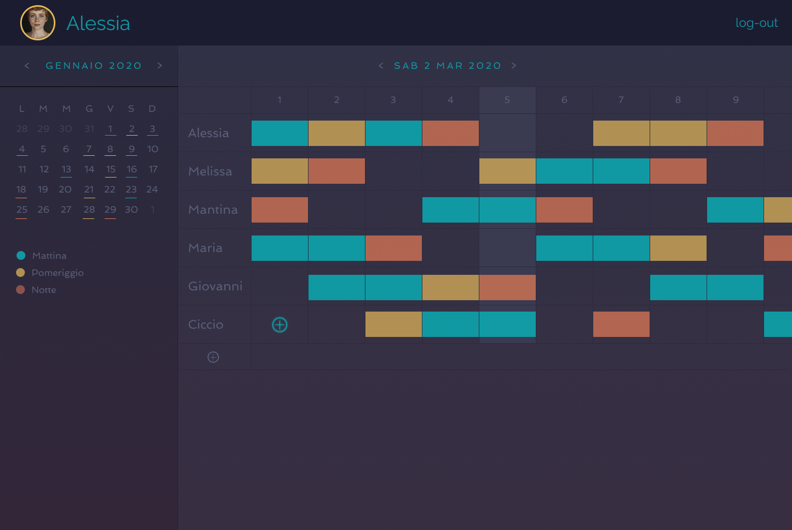

# Il mio Turno (My Turn)

## TODO

### Preliminaries

- [x] create react app
- [x] find libraries for calendar view
- [ ] find resources to create own calendar view
- [x] Design the App

## Risorse utili

### Libraries

- [React-Calendar](https://www.npmjs.com/package/react-calendar)
- [FullCalendar](https://github.com/fullcalendar/fullcalendar-react)
- [React-big-Calendar](https://www.npmjs.com/package/react-big-calendar)
- [Simple-React-Calendar](https://github.com/toptal/simple-react-calendar)

### Custom

- [Simple React Calendar with Styled component](https://dev.to/zhiyueyi/how-to-create-a-simple-react-calendar-with-styled-component-42n6)
- [Create a custom calendar in React](https://blog.flowandform.agency/create-a-custom-calendar-in-react-3df1bfd0b728)
- [a Calendar App with React](https://dev.to/aumayeung/how-to-make-a-calendar-app-with-react-2alp)
- [Calendar Component from scratch](https://programmingwithmosh.com/react/build-a-react-calendar-component-from-scratch/)